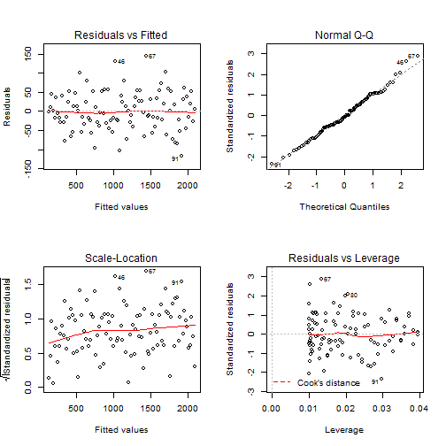

Fitting Line
========================================================
author: Zhangyj
date: 10/9/2015


Generating Data 
========================================================
The Data was generating by a linear function and normal distribution

```r
x <-c(1:100)
y <- 20*x+rnorm(100,mean=0,sd=50)+100
summary(y)
```

```
   Min. 1st Qu.  Median    Mean 3rd Qu.    Max. 
  126.6   646.6  1145.0  1113.0  1619.0  2110.0 
```

```r
summary(x)
```

```
   Min. 1st Qu.  Median    Mean 3rd Qu.    Max. 
   1.00   25.75   50.50   50.50   75.25  100.00 
```

The Fintting Line
========================================================

 

The Parameters and residuals of Fintting Line
========================================================


```
(Intercept)           x 
  107.58904    19.90515 
```

```
[1] 9.511185e-16
```
               
                Thanks for Review
========================================================

